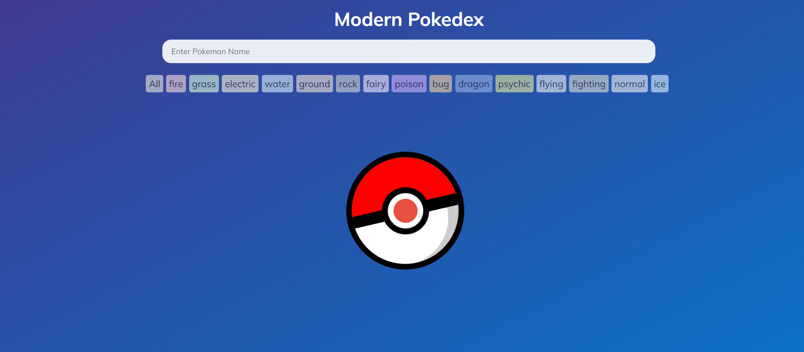

# Pokedax App

#### The Pokedax App is an application that lists 128 Pokémon and allows us to take a closer look at the characteristics of the one we choose. Additionally, we can sort that list by name and types as well..

#### The REST service, which this application sends requests to and retrieves the Pokémon list from, is implemented separately. Github link [here](https://github.com/kadirgurturk/spring-boot-resttemplate-pokemonapi.git)

## Methhodlgy and Used Techs
- This application build by reactjs libary
- Scss is used for styling and Redux-toolkit is used for store managment
- React-query used for request to service

### The application consists of 4 components.
-  Header.js: Input and typelist inlclude this component. Type store value decided in Typlist.js you can choose one simple type and list recompile.Text store value decided in Header.js's input.
- Pokelist.js: We change and listed pokemons list what we display in this component. Http request and sorting used with store values happens in this components.
- TypeList: Every pokemon has a type,This component is a filtering tool for Pokemon types in a React app using Redux. It lets users select a type from a list and stores the selected type for other components to use. 
- PokeCard: This is a simple React component representing a pop-up Pokemon card. It shows the Pokemon's image, name, types, and stats. The card's background color is based on the Pokemon's primary type. Users can close the pop-up.

#### Loading Page

