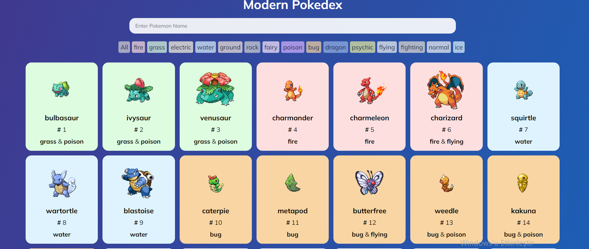
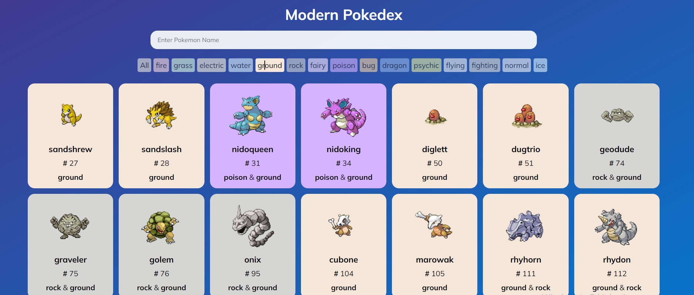
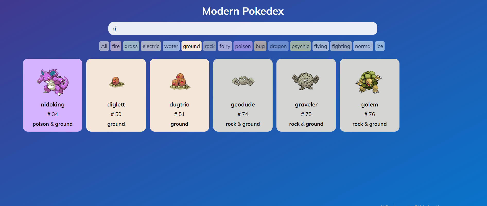
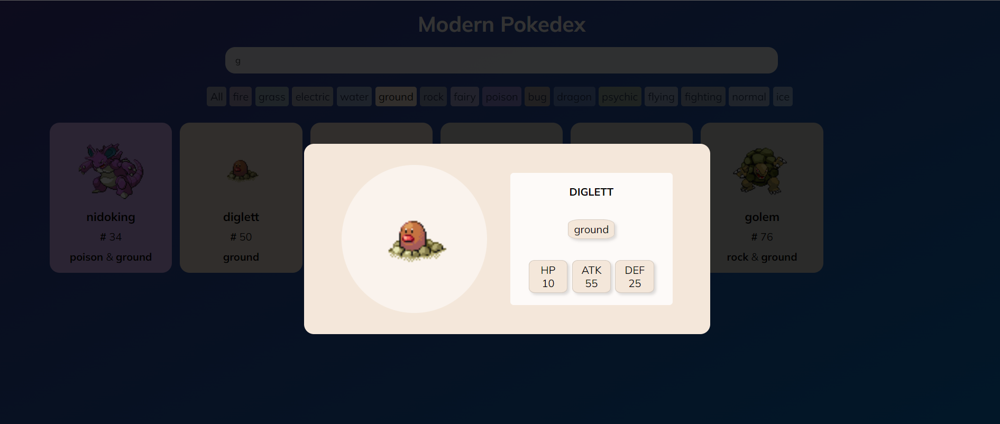

# Pokedax App

#### Pokedax App 128 pokemonu listeleyen ve seçtiğimiz birinin özelliklerine daha yakından baktığımız bir uygulamadır.

## Metotlar ve Teknolojiler
#### Uygulama React kütüphanesi ile yazılmıştır. Uygualamda styling için Sass, state yönetimi İçin Redux kullanılmıştır. Uygulama başladığında her bir pokemon için api'ye istek yapılır, gelen data state'e aktarılır ve listelenir. Listeleme filtrelenebilir, isime göre ve pokemon tipine göre ayrı ayrı yada birlikte listelenen Pokemonlar filtrelinebilir. Listelenen pokemonlardan birine tıkladğınızda o pokemonun daha ayrıntılı özelliklerinin verildiği bir popup ekrana basılır. Popup dan çıkmak için popup dışındaki bir yere tıklamanız yeterlidir.

